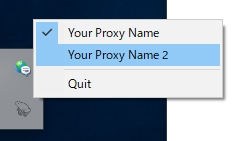

tasktray-proxy
===============

Simple Proxy Server on Tasktray for Windows and Linux (and Mac)  
To engineers suffering from corporate proxies.

## Usage

### Step1 Build

#### Windows(MinGW)
```bash
go build -o ./bin/tasktray-proxy.exe -ldflags -H=windowsgui main.go
```

#### Linux
Require
```bash
sudo apt-get install libgtk-3-dev libappindicator3-dev
```

Build Command
```bash
go build -o ./bin/tasktray-proxy main.go
```

#### Mac
```bash
go build -o ./bin/tasktray-proxy main.go
```


### Step2 Create config file
`config.toml`

```toml
[[PROXY]]
description = "Your Proxy Name"
localHost   = "0.0.0.0"
localPort   = "8989"
authHost    = "some.company.auth.proxy"
authPort    = "8686"
user        = "[YOUR ID]"
password    = "[YOUR PASSWORD]"
network     = "Netowork CIDR"
# wifi      = "Network SSID"
# The "wifi" overrides the "network" if both are used.

[[PROXY]]
description = "Your Proxy Name 2"
localHost   = "0.0.0.0"
localPort   = "8989"

# ...
```

### Step3 Launch
```bash
./tasktray-proxy -c ./config.toml
```

If you do not configure the config file, config.toml in the directory where the binary file exists will be read.
### Step4 Change Proxy Server


